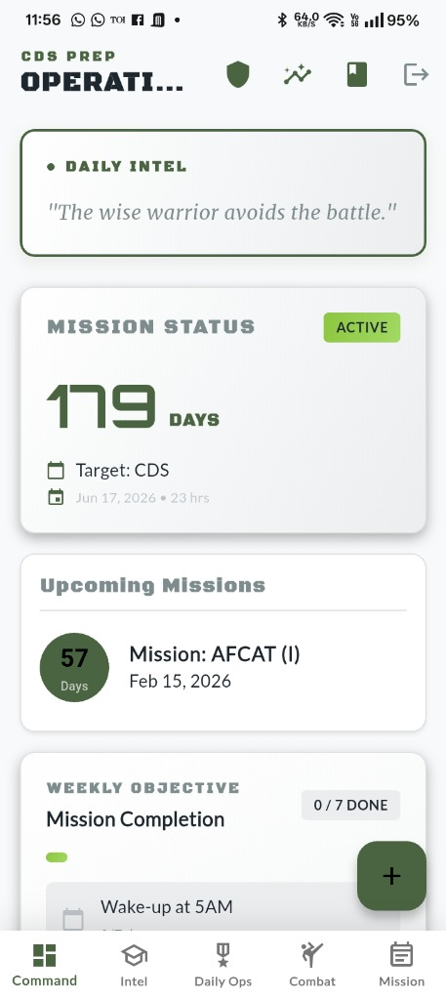
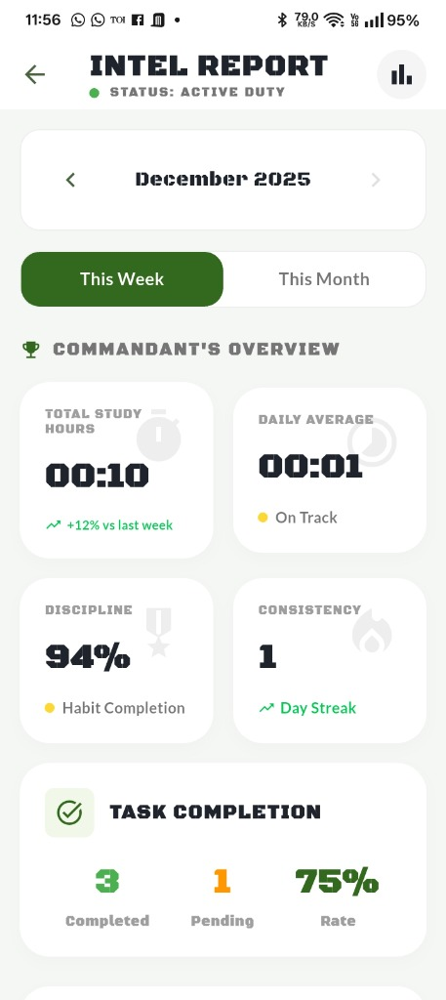
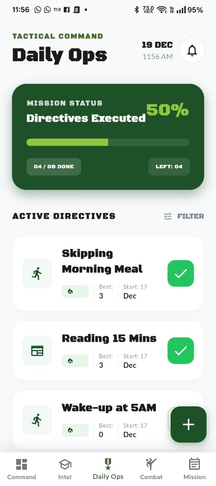
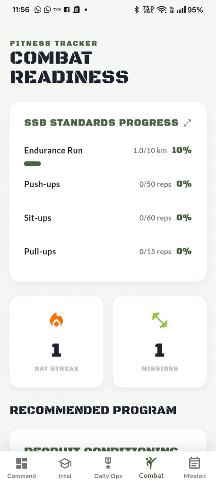
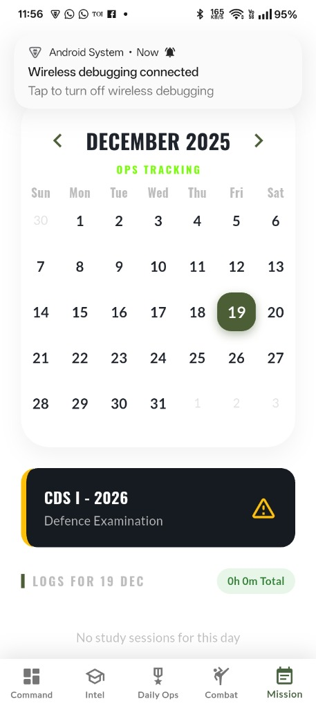

# PRAHAAR - CDS Aspirant Productivity App


**PRAHAAR** is a comprehensive productivity application designed specifically for Combined Defence Services (CDS) aspirants. Built with a military-themed design philosophy, it helps candidates prepare for their exams through gamification, structured study tracking, fitness monitoring, and tactical assessments.

## 📱 Screenshots

<div align="center">

| Dashboard | Intel Report | Daily Ops |
|:---------:|:------------:|:---------:|
|  |  |  |

| Combat Readiness | Ops Calendar |
|:----------------:|:------------:|
|  |  |

</div>

---

## 🎯 Features

### 📚 Study Management
- **Study Timer**: Track study sessions with pause/resume functionality
- **Study History**: View past sessions with heatmap calendar visualization
- **Subject Tracking**: Monitor time spent on each subject
- **Session Notes**: Add notes to study sessions for better organization

### 📝 Task & Planning
- **Task Management**: Create, complete, and delete daily tasks
- **Weekly Goals**: Set and track weekly objectives
- **Ops Calendar**: Manage events and important dates
- **Exam Countdown**: Dynamic countdown to your target exam date

### 🎯 Quiz System
- **Tactical Assessments**: Practice questions across subjects (English, GK, Math)
- **Difficulty Levels**: Easy, Medium, and Hard question sets
- **Customizable Sessions**: Choose question count (5-25 questions)
- **Performance Tracking**: Monitor quiz history and scores

### 💪 Fitness Tracker
- **SSB-Focused Workouts**: Track Running, Push-ups, Sit-ups, Pull-ups
- **SSB Standards**: Compare performance against official benchmarks
- **Personal Bests**: Track your best performances
- **Workout Streak**: Monitor consistency

### 🏆 Gamification
- **XP & Leveling System**: Earn XP and level up (100 XP per level)
- **Achievements**: Unlock military-themed achievements
  - Study Honors
  - General Decorations
  - Fitness Medals
- **Leaderboards**: Compete across categories
  - Total XP
  - Study Hours
  - Fitness Workouts
  - Current Streak

### 📊 Analytics (Intel Report)
- **Performance Dashboard**: Visualize study patterns and progress
- **Month Selector**: Navigate through historical data
- **Mock Test Analytics**: 
  - Subject-wise score breakdown
  - CDS/AFCAT marking schemes with negative marking
  - Average scores and performance trends
- **Week Performance Comparison**: 
  - Compare current vs previous week
  - Study hours, workouts, habit streaks
  - Percentage improvements/declines
- **Best Week Tracking**: See your all-time best performing week (last 12 weeks)
- **Study Distribution**: Time allocation across subjects
- **Trend Analysis**: Track improvement over time
- **No Future Month Access**: Can only view current and past months

### 🔄 Dynamic Updates
- **Midnight Refresh System**: All trackable features auto-refresh at 12:00 AM
  - Weekly goals, habit challenges, daily ops
  - Combat missions, habit tracking
  - No app restart required
- **Real-time Performance Updates**: Weekly performance card updates instantly
- **Reactive Providers**: StreamProvider-based architecture for live data

### ⚙️ User Settings
- **Profile Management**: Customize display name and preferences
- **Exam Configuration**: Set exam date and type (CDS, AFCAT, NDA, INET)
- **Notification Preferences**: Control reminders for habits and study
- **Study Preferences**: Set preferred study time and daily goals

---

## 🏗️ Architecture

### Tech Stack
- **Framework**: Flutter 3.3.0+
- **State Management**: Riverpod 2.5.1
- **Backend**: Firebase (Auth, Firestore)
- **UI Components**: Google Fonts, FL Chart, Table Calendar
- **Local Storage**: SharedPreferences
- **Notifications**: flutter_local_notifications

### Project Structure
```
lib/
├── core/                    # Core utilities and services
│   ├── models/             # App-wide models (AppError)
│   ├── services/           # NotificationService
│   ├── theme/              # Military-themed design system
│   ├── utils/              # ErrorHandler, validators
│   └── widgets/            # ErrorBoundary, reusable widgets
├── data/                    # Shared data layer
│   ├── datasources/        # FirestoreService (centralized)
│   └── models/             # Shared models (8 models)
├── features/               # Feature modules
│   ├── analytics/          # Performance analytics
│   ├── auth/               # Authentication
│   ├── calendar/           # Event calendar
│   ├── dashboard/          # Main command center
│   ├── fitness/            # Workout tracking
│   ├── gamification/       # XP, achievements, leaderboards
│   ├── planning/           # Goals and planning
│   ├── prep/               # Mock tests and revision
│   ├── quiz/               # Quiz system
│   ├── reflection/         # Journal entries
│   ├── settings/           # User settings
│   └── tracking/           # Study timer and history
└── providers/              # Riverpod providers
```

### Design Patterns
- **Feature-based architecture**: Each feature is self-contained
- **Repository pattern**: FirestoreService acts as data repository
- **Provider pattern**: Riverpod for state management
- **Error handling**: Centralized error handling with AppError model

---

## 🚀 Getting Started

### Prerequisites
- Flutter SDK (>=3.3.0 <4.0.0)
- Firebase project with Firestore and Authentication enabled
- Android Studio / VS Code with Flutter extensions

### Installation

1. **Clone the repository**
   ```bash
   git clone <repository-url>
   cd prahaar
   ```

2. **Install dependencies**
   ```bash
   flutter pub get
   ```

3. **Configure Firebase**
   - Create a Firebase project at [Firebase Console](https://console.firebase.google.com/)
   - Add Android/iOS apps to your Firebase project
   - Download and place `google-services.json` (Android) and `GoogleService-Info.plist` (iOS)
   - Run FlutterFire CLI to generate `firebase_options.dart`:
     ```bash
     flutterfire configure
     ```

4. **Deploy Firestore Security Rules**
   ```bash
   firebase deploy --only firestore:rules
   ```

5. **Run the app**
   ```bash
   flutter run
   ```

---

## 🔐 Security

### Firestore Security Rules
The app implements comprehensive security rules:
- Users can only access their own data
- Questions collection is read-only for authenticated users
- Leaderboards are read-only (updated server-side)
- All writes are validated and authenticated

### Error Handling
- Global error boundary catches unhandled exceptions
- Firebase errors are mapped to user-friendly messages
- Input validation prevents invalid data submission
- Offline mode detection and handling

---

## 📱 Firestore Collections

```
users/{userId}/
├── settings/main          # User preferences and exam config
├── tasks/                 # Daily tasks
├── studySessions/         # Study session logs
├── habits/                # Habit definitions
├── habitLogs/             # Habit completion logs
├── mockTests/             # Mock test results
├── revisionTopics/        # Spaced repetition topics
├── journalEntries/        # Daily reflections
├── weeklyGoals/           # Weekly objectives
├── workouts/              # Fitness logs
├── calendarEvents/        # User events
├── calendarEvents/        # User events
├── stats/main             # XP, level, streaks
├── achievements/          # Unlocked achievements
└── quizSessions/          # Quiz history

Global Collections:
├── questions/             # Quiz question bank
├── leaderboards/          # Global rankings
└── achievements/          # Achievement definitions
```

---

## 🎨 Design System

### Color Palette
- **Command Gold**: `#D4AF37` - Primary accent
- **Military Green**: `#4A6341` - Secondary accent
- **Status Active**: `#76FF03` - Success/active states
- **Status Warning**: `#FFC107` - Warning states
- **Status Error**: `#F44336` - Error states

### Typography
- **Military Headings**: Black Ops One / Oswald
- **Body Text**: Lato / Roboto
- **Monospace**: Courier for stats

---

## 🤝 Contributing

Contributions are welcome! Please follow these guidelines:
1. Fork the repository
2. Create a feature branch (`git checkout -b feature/AmazingFeature`)
3. Commit your changes (`git commit -m 'Add some AmazingFeature'`)
4. Push to the branch (`git push origin feature/AmazingFeature`)
5. Open a Pull Request

---

## 📄 License

This project is licensed under the MIT License - see the LICENSE file for details.

---

## 🙏 Acknowledgments

- Flutter team for the amazing framework
- Firebase for backend infrastructure
- All CDS aspirants for inspiration

---

## 📞 Support

For support, email support@prahaar.app or open an issue in the repository.

---

**"SWEAT IN PEACE, BLEED LESS IN WAR"** 🎖️

---

## 🆕 Recent Updates (December 2024)

### Latest Features Implemented
- ✅ **Habit Challenge Day Locking**: Only current day can be logged (prevents cheating)
- ✅ **Success Dialogs**: Animated motivational feedback for habits and study sessions
- ✅ **Dynamic Performance Card**: Real-time study/workout updates without restart
- ✅ **Midnight Refresh System**: Auto-updates all tracking at 12:00 AM
- ✅ **Intel Report Enhancements**:
  - Mock test analytics with subject-wise breakdown
  - Week performance comparison (current vs previous)
  - Best week tracking
  - Month selector with past-only navigation
  - Study time distribution visualization
- ✅ **Weekly Goals Persistence**: Goals stay visible across weeks until manually deleted
- ✅ **Flexible Study Logging**: Minimum session duration reduced to 1 minute
- ✅ **CDS/AFCAT Marking Schemes**: 
  - CDS: +1 for correct, -⅓ for incorrect
  - AFCAT: +3 for correct, -1 for incorrect
- ✅ **Type Safety Fixes**: Resolved comparison function type mismatches
- ✅ **WorkoutModel Field Corrections**: Fixed date field access issues

---

## 🗺️ Roadmap

### Upcoming Features
- [ ] Cloud Functions for leaderboard aggregation
- [ ] Social features (study groups)
- [ ] Video lessons integration
- [ ] Advanced analytics with ML insights
- [ ] Offline mode with sync
- [ ] Multi-language support
- [ ] Dark mode toggle
- [ ] Export study data
- [ ] Integration with external calendars

---

Built with ❤️ for CDS aspirants
